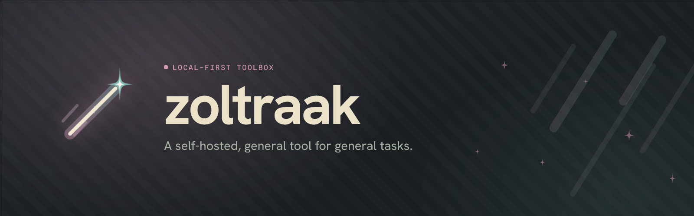

<p align="center">
    
</p>

<p align="center">
  <a href="https://github.com/Vyanide/zoltraak/actions/workflows/ci.yml"></a>
  <a href="https://github.com/Vyanide/zoltraak/releases"></a>
  <a href="LICENSE"></a>
</p>

Named after the now ordinary offensive magic spell from _Frieren_, **zoltraak** is a
self-hosted toolbox for everyday PDF, image and text tasks. Pick a tool,
drop a file in, and the work runs on your own machine — nothing is uploaded to a
third-party service.

## Features

- **PDF** — reorder, merge, split, encrypt, unlock, and extract images.
- **Image** — convert & compress, crop, resize, pad, and remove backgrounds.
- **Text** — word counter, case converter, lorem ipsum, and more.
- **Local-first** — files are processed on your own machine, never uploaded.

## Deployment

Runs as a two-container stack (frontend + backend) with Docker Compose.

```bash
git clone https://github.com/Vyanide/zoltraak.git && cd zoltraak
cp .env.example .env          # optional — tweak ports / backend URL
docker compose up --build     # web → http://localhost:5173
```

### Environment variables

Configuration lives in a `.env` file next to `docker-compose.yml` (copied from
`.env.example`). Every variable has a default, so `.env` is optional:

| Variable          | Default                 | Description                                                                                              |
| ----------------- | ----------------------- | -------------------------------------------------------------------------------------------------------- |
| `VITE_SERVER_URL` | `http://localhost:3000` | Backend origin the browser calls — baked into the web bundle at **build time** (rebuild after changing). |
| `WEB_PORT`        | `5173`                  | Host port the web app is published on.                                                                   |
| `SERVER_PORT`     | `3000`                  | Host port the backend is published on (keep `VITE_SERVER_URL` in sync).                                  |
